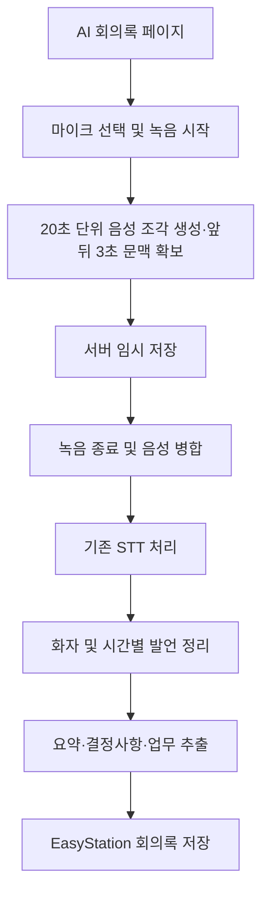

# 웹 녹음을 이용한 AI 회의록 생성

## 1. 목적

현재 EasyStation의 AI 회의록 기능은 사용자가 미리 녹음한 음성 파일을 업로드한 뒤 STT를 실행하는 방식이다. 이 방식은 별도 녹음 앱을 사용하고, 녹음 파일을 찾아 다시 업로드해야 하는 불편이 있다.

이를 개선하기 위해 AI 회의록 페이지에 **웹 직접 녹음** 옵션을 추가한다. 사용자는 회의록 작성 화면에서 바로 녹음을 시작하고, 회의 종료 후 기존 STT·화자 분리·요약 파이프라인으로 회의록을 생성할 수 있어야 한다.

핵심 원칙은 다음과 같다.

- 기존 음성 파일 업로드 기능은 그대로 유지한다.
- 웹 녹음은 파일 업로드와 나란히 제공하는 추가 입력 방식으로 구현한다.
- 녹음 결과를 기존 업로드 음성과 같은 형식으로 만들어 공통 STT 파이프라인에 전달한다.
- 긴 회의와 네트워크 장애에 대비하여 음성을 작은 조각으로 안전하게 저장한다.
- 초기 버전은 실시간 자막보다 **녹음 안정성과 종료 후 정확한 분석**에 우선순위를 둔다.

## 2. 목표 사용자 흐름

회의록 작성 화면에서 사용자는 다음 두 입력 방식 중 하나를 선택한다.

```text
AI 회의록 생성
├── 음성 파일 업로드
└── 웹에서 직접 녹음
```

웹 녹음을 선택한 경우 전체 흐름은 다음과 같다.



권장 기본 흐름은 다음과 같다.

> 웹 녹음 → 20초 단위 자동 저장과 앞뒤 3초 문맥 확보 → 녹음 종료 → 기존 STT 처리 → 화자 이름 지정 → 회의 요약·결정사항·담당 업무 생성

## 3. 사용자 화면

### 3.1 녹음 전

기존 파일 선택 영역에 `직접 녹음` 옵션을 추가한다.

- 입력 방식 선택: `파일 업로드` / `직접 녹음`
- 사용할 마이크 선택
- 마이크 권한 및 입력 상태 확인
- 녹음 동의 안내
- `녹음 시작` 버튼

브라우저의 마이크 장치 이름은 마이크 권한이 승인된 뒤에만 정상적으로 표시될 수 있다. 마이크 접근은 보안 컨텍스트가 필요하므로 운영 환경은 HTTPS를 사용해야 한다. 단, 브라우저 정책상 `localhost` 개발 환경은 예외적으로 허용될 수 있다.

### 3.2 녹음 중

녹음 중에는 현재 상태를 명확하게 표시한다.

```text
🔴 녹음 중 01:23:45
마이크: 기본 마이크
입력 음량: 정상
전송 상태: 정상 · 마지막 저장 5초 전

[일시정지] [중요 발언 표시] [녹음 종료]
```

필수 화면 요소는 다음과 같다.

- 녹음 상태와 경과 시간
- 마이크 입력 음량
- 사용 중인 마이크
- 서버 전송 상태와 미전송 조각 수
- 녹음 시작·일시정지·재개·종료
- 중요 발언 표시
- 권한 거부, 마이크 없음, 무음, 네트워크 단절 안내

녹음 도중 마이크를 변경할 경우에는 현재 조각을 먼저 종료·전송한 뒤 새 장치 스트림으로 교체한다. 변경 실패 시 기존 마이크를 계속 사용하거나 사용자에게 녹음 중단 여부를 안내한다.

### 3.3 녹음 종료 후

종료 요청 후에는 처리 단계를 순서대로 표시한다.

```text
미전송 음성 확인 중
→ 음성 파일 생성 중
→ 음성 변환 중
→ 발언자 정리 중
→ 회의 내용 분석 중
→ 회의록 생성 완료
```

모든 음성 조각이 서버에 저장되기 전에는 STT를 시작하지 않는다. 누락된 조각이 있으면 자동 재전송을 우선 수행하고, 계속 실패할 경우 누락 범위와 재시도 방법을 사용자에게 알린다.

### 3.4 통합 음성 파일 다운로드

음성 병합이 완료되면 회의록 화면에 `통합 음성 다운로드` 버튼을 표시한다.

```text
회의 음성 01:23:45 · 72.4 MB
[재생] [통합 음성 다운로드]
```

- 녹음 중이거나 조각 업로드·병합이 끝나지 않은 동안에는 다운로드 버튼을 비활성화한다.
- 사용자는 분할 조각 여러 개가 아니라 **회의 전체가 합쳐진 하나의 음성 파일**만 다운로드한다.
- 병합 또는 변환 중이면 현재 처리 상태를 표시하고 완료 후 버튼을 활성화한다.
- 음성이 삭제되었거나 다운로드 권한이 없으면 버튼을 표시하지 않는다.
- 다운로드 실행과 결과는 감사 로그에 기록한다.

권장 다운로드 파일명은 다음과 같다.

```text
회의제목_YYYYMMDD_HHmmss.mp3
```

파일명에는 운영체제에서 사용할 수 없는 문자와 경로 문자를 제거하고, 회의 제목이 없으면 `회의녹음_YYYYMMDD_HHmmss.mp3`를 사용한다.

### 3.5 백그라운드 녹음 검토

#### 결론

백그라운드 녹음은 **조건부로 가능**하다. 데스크톱 브라우저에서 EasyStation 탭을 유지한 채 다른 탭이나 다른 애플리케이션을 사용하는 경우에는 일반적으로 마이크 녹음을 계속할 수 있다. EasyStation 내부에서 다른 게시글, 메일, 문서 등의 화면으로 이동하면서 녹음을 계속하는 것도 녹음 객체를 페이지의 최상위 영역에서 유지하도록 구조를 변경하면 가능하다.

그러나 일반 웹페이지는 운영체제와 브라우저의 백그라운드 정책을 제어할 수 없다. 브라우저가 탭을 정지 또는 메모리에서 폐기하거나, 모바일 기기가 화면을 잠그거나, 브라우저 앱 자체가 종료되면 녹음을 계속한다고 보장할 수 없다. 따라서 이 기능은 `완전한 백그라운드 녹음 보장`이 아니라 **다른 작업 중에도 가능한 범위에서 녹음을 유지하고, 중단 시 이미 저장된 조각을 복구하는 기능**으로 정의한다.

| 사용 상황 | 지원 판단 | 비고 |
| --- | --- | --- |
| EasyStation 탭을 열어 둔 채 다른 데스크톱 앱 사용 | 지원 | 브라우저와 탭이 실행 중이어야 함 |
| EasyStation 탭을 열어 둔 채 다른 브라우저 탭 사용 | 지원 | 백그라운드 타이머 지연과 조각 크기 변동에 대비 |
| EasyStation 안에서 다른 게시글·메일·문서 작업 | 지원하도록 개선 | 녹음 상태를 화면 컴포넌트 밖으로 이동해야 함 |
| 브라우저 최소화 | 조건부 지원 | 절전 정책과 탭 정지 가능성 존재 |
| 데스크톱 화면 잠금 또는 시스템 절전 | 보장하지 않음 | 장치와 브라우저 정책에 따라 마이크·스크립트 중단 가능 |
| 모바일에서 다른 앱으로 전환 | 보장하지 않음 | 운영체제가 브라우저를 빠르게 정지할 수 있음 |
| 모바일 화면 잠금 | 보장하지 않음 | Safari 또는 Android Chrome에서 마이크나 `dataavailable` 이벤트가 중단·지연될 수 있음 |
| 브라우저 또는 탭 종료 | 지원 불가 | 종료 전 서버로 전송된 조각과 IndexedDB 데이터만 복구 가능 |
| PC 종료·강제 재부팅 | 지원 불가 | 마지막으로 저장 완료된 조각까지만 보존 |

#### 현재 구현의 제한

현재 웹 녹음 상태와 `MediaRecorder`는 `ChatArea.jsx`의 회의록 본문 컴포넌트 안에서 관리한다. 이 상태에서는 외부 브라우저 탭이나 다른 데스크톱 앱을 사용하는 동안에는 녹음이 유지될 수 있지만, EasyStation 내부에서 선택한 게시글을 바꾸어 해당 컴포넌트가 언마운트되면 정리 함수가 녹음을 종료한다.

따라서 `다른 EasyStation 업무를 하면서 계속 녹음`하려면 녹음 수명주기를 회의록 화면 수명주기와 분리하는 추가 구조 변경이 필요하다.

#### 권장 화면 동작

녹음이 시작되면 어느 EasyStation 화면으로 이동하더라도 상단 또는 우측 하단에 전역 녹음 컨트롤을 계속 표시한다.

```text
┌──────────────────────────────────────────┐
│ 🔴 주간 업무 회의 녹음 중 00:42:18      │
│ 서버 저장 정상 · 미전송 0개             │
│ [회의록으로 이동] [일시정지] [종료]     │
└──────────────────────────────────────────┘
```

- 현재 녹음 중인 회의 제목과 경과 시간을 표시한다.
- 어느 메뉴에서든 일시정지·재개·종료할 수 있게 한다.
- `회의록으로 이동`을 누르면 원래 회의록 게시글을 연다.
- 전송 실패 조각 수와 마지막 서버 저장 시각을 표시한다.
- 백그라운드 전환 또는 Wake Lock 해제 시 경고 상태를 표시한다.
- 동일 브라우저에서 두 회의를 동시에 녹음하지 못하게 한다.
- 다른 회의에서 녹음을 시작하려 하면 기존 녹음을 종료할지 확인한다.

#### 권장 프런트엔드 구조

`MediaRecorder`, 마이크 스트림, 업로드 큐와 녹음 상태를 `ContentRenderer` 내부가 아니라 앱 최상위에 위치한 `MeetingRecordingProvider` 또는 전역 녹음 서비스로 이동한다.

```text
App
└── MeetingRecordingProvider
    ├── MediaStream / MediaRecorder
    ├── meeting_id / post_id / channel_id
    ├── 20초 조각 생성 및 업로드 큐
    ├── IndexedDB 임시 저장 및 복구
    ├── Page Visibility / Page Lifecycle 감시
    ├── Screen Wake Lock 관리
    └── GlobalMeetingRecorderBar
        ├── ChatArea
        ├── Mail
        ├── Calendar
        ├── EasyPage
        └── 기타 업무 화면
```

이 구조에서는 `ChatArea`가 녹음을 직접 소유하지 않고 전역 서비스에 시작·정지 요청만 전달한다. 게시글이나 메뉴가 변경되어도 최상위 Provider가 유지되는 동안 녹음과 업로드가 계속된다.

여러 브라우저 탭에서 EasyStation을 열 수 있으므로 `BroadcastChannel` 또는 Web Locks API로 녹음 소유 탭을 조정한다.

- 녹음을 시작한 탭을 `owner tab`으로 지정한다.
- 다른 EasyStation 탭에는 녹음 상태만 동기화하고 새 녹음 시작을 차단한다.
- 녹음 종료와 업로드는 owner tab만 수행한다.
- owner tab이 사라지면 다른 탭이 마이크 녹음을 그대로 인계할 수는 없다. 이 경우 서버 저장분을 확인하고 사용자에게 복구·종료 처리를 안내한다.

#### 브라우저 백그라운드 정책 대응

`MediaRecorder.start(20000)`의 `timeslice`는 정확한 20초 타이머가 아니다. 백그라운드 작업 제한, Safari의 마이크 일시정지, Android Chrome의 화면 잠금 등에 의해 `dataavailable` 이벤트가 늦게 발생하고 한 조각이 20초보다 훨씬 커질 수 있다. 따라서 조각 번호만으로 시간을 계산하지 않고 `BlobEvent.timeStamp`, 녹음 시작 기준 monotonic time과 실제 미디어 재생 시간을 함께 기록한다. [MDN MediaRecorder dataavailable 안내](https://developer.mozilla.org/en-US/docs/Web/API/MediaRecorder/dataavailable_event)

백그라운드에서는 JavaScript 타이머와 네트워크 콜백이 제한될 수 있으므로 다음 기준을 적용한다.

- `setInterval`로 표시하는 시간은 화면 표시용으로만 사용한다.
- 실제 조각 시작·종료 시간은 이벤트 타임스탬프와 서버 검증 결과를 기준으로 한다.
- 조각의 실제 크기와 길이를 허용 범위 안에서 가변적으로 처리한다.
- 20초를 크게 초과한 조각도 업로드할 수 있도록 서버 크기 제한에 여유를 둔다.
- 탭이 다시 활성화되면 서버 보유 조각과 IndexedDB 조각을 즉시 대조한다.
- `visibilitychange`에서 현재 세션 메타데이터와 미전송 조각 상태를 즉시 저장한다.
- 화면 갱신, 음량 애니메이션 등 불필요한 작업은 숨김 상태에서 중단한다.
- 녹음과 업로드가 정상인지 `MediaStreamTrack.readyState`, `MediaRecorder.state`, 마지막 `dataavailable` 시각으로 점검한다.

Chrome의 Page Lifecycle에서 페이지가 `frozen` 상태가 되면 타이머와 `fetch` 콜백 같은 작업이 정지하며, `discarded` 상태에서는 페이지의 JavaScript가 전혀 실행되지 않는다. 폐기는 별도 이벤트 없이 일어날 수도 있으므로 종료 이벤트에만 의존해서는 안 된다. 상태는 녹음 중 주기적으로 저장하고 페이지 복원 시 `document.wasDiscarded`와 IndexedDB 세션을 확인한다. [Chrome Page Lifecycle API 안내](https://developer.chrome.com/docs/web-platform/page-lifecycle-api), [Chrome 메모리 절약 모드 안내](https://developer.chrome.com/blog/memory-and-energy-saver-mode)

#### 화면 잠금 방지

지원 브라우저에서는 녹음 시작 시 Screen Wake Lock을 요청하여 화면 자동 꺼짐과 잠금 가능성을 줄인다.

```javascript
let wakeLock = null

async function requestRecordingWakeLock() {
  if (!('wakeLock' in navigator)) return
  wakeLock = await navigator.wakeLock.request('screen')
}

document.addEventListener('visibilitychange', async () => {
  if (document.visibilityState === 'visible' && isRecording) {
    await requestRecordingWakeLock()
  }
})
```

Wake Lock은 HTTPS에서만 사용할 수 있고, 페이지가 보이지 않거나 배터리가 부족하거나 절전 정책이 적용되면 운영체제가 해제할 수 있다. 녹음이 끝나면 명시적으로 해제하고, 페이지가 다시 보일 때 필요하면 재요청한다. Wake Lock은 안정성을 높이는 보조 수단이며 백그라운드 녹음을 보장하는 수단은 아니다. [MDN Screen Wake Lock API 안내](https://developer.mozilla.org/en-US/docs/Web/API/Screen_Wake_Lock_API)

#### Service Worker 사용 여부

Service Worker는 마이크 스트림과 `MediaRecorder`를 소유하여 녹음을 계속하는 용도로 사용하지 않는다. Service Worker는 페이지와 별도의 수명을 가지며 언제든 종료될 수 있으므로 장시간 녹음 실행 주체로 적합하지 않다.

Service Worker 또는 Background Sync는 이미 생성되어 IndexedDB에 저장된 조각의 업로드 재시도를 보조하는 용도로만 검토한다. 마이크 캡처와 조각 생성은 살아 있는 페이지의 전역 녹음 Provider가 담당한다.

#### 백그라운드 중단 감지

다음 상황을 감지하면 녹음 상태를 `warning` 또는 `interrupted`로 변경한다.

- 마이크 트랙의 `ended`, `mute` 이벤트 발생
- `MediaRecorder`의 예기치 않은 `inactive` 전환 또는 `error` 발생
- 마지막 `dataavailable` 이후 허용 시간을 크게 초과
- 서버 업로드 확인이 일정 시간 이상 없음
- 페이지가 `frozen` 후 복귀하거나 `document.wasDiscarded === true`
- IndexedDB와 서버의 마지막 조각 순번 불일치

화면 복귀 시에는 다음 순서로 처리한다.

1. 마이크 트랙과 `MediaRecorder`가 여전히 활성 상태인지 확인한다.
2. IndexedDB와 서버가 보유한 마지막 조각 순번을 비교한다.
3. 미전송 조각을 먼저 업로드한다.
4. 녹음이 실제로 계속되고 있으면 상태를 `recording`으로 복구한다.
5. 마이크가 중단되었다면 자동으로 새 스트림을 열지 않고 사용자 동의를 받아 재개한다.
6. 중단 구간의 시작·종료 시각을 기록하고 최종 회의록에 누락 가능성을 표시한다.

#### 구현 우선순위

백그라운드 녹음은 다음 순서로 적용한다.

1. 녹음 상태를 `MeetingRecordingProvider`로 이동하여 EasyStation 내부 화면 이동을 지원한다.
2. 모든 화면에서 보이는 전역 녹음 바를 추가한다.
3. `visibilitychange`, 트랙 종료, 녹음 오류와 업로드 지연을 감지한다.
4. Screen Wake Lock과 재획득 로직을 추가한다.
5. 멀티 탭 녹음 잠금과 상태 동기화를 추가한다.
6. 데스크톱 Chrome·Edge·Firefox·Safari에서 탭 전환과 최소화를 검증한다.
7. 모바일은 화면 잠금과 앱 전환을 지원 보장이 아닌 제한 사항으로 명시하고 기기별로 검증한다.

백그라운드 녹음의 권장 지원 범위는 다음과 같이 고정한다.

> EasyStation 내부 화면 이동과 데스크톱의 다른 탭·애플리케이션 사용 중 녹음은 지원한다. 브라우저 종료, 탭 폐기, 시스템 절전, 모바일 화면 잠금 후의 연속 녹음은 보장하지 않으며, 이미 저장된 조각의 복구를 보장한다.

## 4. 녹음 및 저장 방식

### 4.1 브라우저 녹음

브라우저에서는 다음 Web API를 사용한다.

- `navigator.mediaDevices.getUserMedia()`: 마이크 권한 요청과 입력 스트림 획득
- `MediaRecorder`: 녹음과 음성 조각 생성
- `MediaDevices.enumerateDevices()`: 사용 가능한 마이크 목록 조회
- Web Audio API: 입력 음량 표시와 무음 감지

기본 녹음 형식은 브라우저가 지원하는 `audio/webm;codecs=opus`를 우선 사용한다. Safari 등 브라우저별 지원 형식이 다를 수 있으므로 `MediaRecorder.isTypeSupported()`로 실제 지원 여부를 확인하고, 지원되는 형식을 서버에 함께 전달한다.

### 4.2 분할 업로드

회의 전체를 메모리에 보관했다가 한 번에 업로드하지 않는다. `MediaRecorder.start(20000)` 또는 명시적인 조각 전환을 이용해 약 20초 단위로 음성 조각을 만들고 즉시 서버로 전송한다.

STT가 조각 경계에서 문장이나 화자의 맥락을 놓치지 않도록 각 20초 핵심 구간을 분석할 때 **앞 3초와 뒤 3초를 겹쳐 최대 26초 구간**을 STT 입력으로 사용한다. 예를 들어 핵심 구간이 `00:20~00:40`이면 STT 문맥 구간은 `00:17~00:43`이다. 첫 구간은 앞쪽 음성이 없으므로 `00:00`부터 시작하고, 마지막 구간은 실제 녹음 종료 시각까지만 포함한다.

브라우저에서 전송하는 저장 조각 자체는 연속된 20초 단위로 유지하고, 서버가 인접 조각을 참조하여 앞뒤 3초 문맥을 구성하는 방식을 우선 권장한다. 이렇게 하면 브라우저 구현과 재전송은 단순하게 유지하면서 STT에는 겹치는 문맥을 제공할 수 있다. 실제 전송 조각을 겹쳐 생성하는 구현을 선택하더라도 아래의 핵심 구간과 문맥 구간 정보를 반드시 기록해야 한다.

각 조각에는 다음 정보를 포함한다.

```json
{
  "meeting_id": "meeting_xxxx",
  "sequence": 17,
  "started_at_ms": 320000,
  "duration_ms": 20000,
  "core_start_ms": 320000,
  "core_end_ms": 340000,
  "context_start_ms": 317000,
  "context_end_ms": 343000,
  "content_type": "audio/webm;codecs=opus",
  "size": 184320,
  "sha256": "..."
}
```

- `meeting_id`: 녹음 세션 식별자
- `sequence`: 0부터 증가하는 조각 순번
- `started_at_ms`, `duration_ms`: 회의 시작 기준 시간 정보
- `core_start_ms`, `core_end_ms`: 최종 음성과 최종 전사문에 반영할 핵심 20초 범위
- `context_start_ms`, `context_end_ms`: STT 분석에만 사용하는 앞뒤 3초 포함 범위
- `content_type`: 실제 브라우저 녹음 형식
- `sha256`: 전송 무결성 및 중복 확인값

서버는 `(meeting_id, sequence)`를 유일 키로 취급한다. 같은 조각이 재전송되면 해시가 같을 때 기존 결과를 반환하고, 해시가 다르면 충돌 오류로 처리한다.

### 4.2.1 겹침 구간의 STT 결과 정리

앞뒤 3초를 포함하면 인접 분석 구간에서 같은 발언이 두 번 인식될 수 있다. 겹침은 문맥 판정에 사용하되 최종 전사문에는 중복 발언을 남기지 않는다.

- 각 분석 결과에서 기본적으로 해당 조각의 `core_start_ms` 이상 `core_end_ms` 미만에 시작한 발언을 채택한다.
- 경계에 걸친 문장은 단순히 잘라 붙이지 않고 단어 타임스탬프, 문장 유사도와 화자 정보를 이용해 하나로 결합한다.
- 같은 시간대에 유사한 문장이 두 번 나오면 신뢰도가 높은 결과 하나만 유지한다.
- 화자 판정은 앞뒤 3초 문맥을 참고하되 최종 화자 구간은 핵심 시간 범위에 맞춰 정리한다.
- 중요 발언 마커와 타임스탬프는 원본 회의 시작 기준 절대 오프셋을 유지한다.
- 중복 제거 후에도 문장이 누락되지 않았는지 경계별 검증 로그를 남긴다.

### 4.3 브라우저 임시 보관

전송 실패 조각은 메모리에만 두지 않고 IndexedDB에 임시 보관한다.

- 서버가 저장 완료를 응답하기 전에는 로컬 조각을 삭제하지 않는다.
- 네트워크 복구 시 순번대로 자동 재전송한다.
- 새로고침 또는 브라우저 재실행 후에도 `meeting_id`를 이용해 복구할 수 있게 한다.
- 서버 상태와 로컬 조각 목록을 비교하여 누락된 조각만 다시 전송한다.
- 회의가 정상 완료된 뒤 로컬 임시 데이터를 정리한다.

`beforeunload` 경고는 실수로 페이지를 닫는 일을 줄이는 보조 기능일 뿐이며, 녹음 보존 수단으로 간주하지 않는다. 브라우저 강제 종료와 모바일 운영체제의 탭 종료에 대비하려면 IndexedDB와 즉시 업로드가 반드시 필요하다.

### 4.4 서버 저장과 병합

서버는 조각을 최종 저장소에 바로 노출하지 않고 회의별 임시 공간에 저장한다.

```text
temporary/meetings/{meeting_id}/
├── manifest.json
├── chunk-000000.webm
├── chunk-000001.webm
└── chunk-000002.webm
```

회의 종료 시 서버는 다음 순서로 처리한다.

1. 요청된 최종 순번과 서버가 보유한 조각 목록을 비교한다.
2. 누락, 중복, 해시 불일치를 검사한다.
3. FFmpeg로 조각을 시간순으로 병합하고 STT 입력 규격으로 정규화한다.
4. 생성된 원본 또는 정규화 음성을 기존 첨부 파일과 같은 저장 정책으로 등록한다.
5. 기존 STT 작업을 생성한다.
6. 성공 시 임시 조각을 보관 정책에 따라 정리한다.

녹음 조각은 브라우저별 컨테이너 특성 때문에 단순 바이트 연결이 항상 유효하지 않다. FFmpeg concat/demux 또는 디코딩 후 재인코딩 방식을 사용하고, 병합 결과의 재생 시간과 디코딩 가능 여부를 검사해야 한다.

앞뒤 3초 겹침은 STT 문맥 확보용이며 최종 병합 음성에 중복으로 넣지 않는다. 최종 원본과 다운로드 MP3는 각 조각의 핵심 20초 범위만 시간순으로 연결하여 실제 회의가 한 번씩만 재생되도록 한다.

### 4.5 다운로드용 단일 음성 생성

다운로드 요청 때마다 모든 조각을 다시 합치지 않는다. 회의 종료 처리에서 조각을 한 번만 검증·병합하고, 그 결과를 다운로드 가능한 단일 음성으로 저장한다.

```text
분할 음성 조각
→ 순번·해시·누락 검사
→ FFmpeg 시간순 병합
→ 재생 시간·디코딩 검사
→ 단일 다운로드 음성 저장
→ 기존 STT 입력과 다운로드에서 공통 사용
```

다운로드 형식은 브라우저와 운영체제 호환성이 높은 MP3를 기본으로 권장한다. STT 정확도를 위해 무손실 정규화 파일이 별도로 필요하면 내부 처리용 WAV와 사용자 다운로드용 MP3를 구분할 수 있지만, 사용자에게는 회의 전체가 들어 있는 파일 한 개만 제공한다.

병합 파일을 만들 때 다음 기준을 적용한다.

- 조각을 `sequence` 오름차순으로 결합한다.
- 누락 또는 해시 불일치가 하나라도 있으면 다운로드 파일을 완료 상태로 만들지 않는다.
- 일시정지 구간은 실제 녹음된 타임라인 정책에 따라 유지하거나 제거하되, 화면의 회의 시간과 음성 재생 시간 차이를 명시한다.
- 중복된 조각은 한 번만 포함한다.
- 병합 결과가 디코딩 가능하고 예상 재생 시간 범위와 일치하는지 검사한다.
- 다운로드 파일의 크기, 재생 시간, MIME 형식, SHA-256 해시를 DB에 저장한다.
- 같은 회의에 대해 병합 파일은 하나만 생성하고, 재처리 시 새 파일 검증이 끝난 뒤 기존 파일을 안전하게 교체한다.

대용량 음성을 애플리케이션 메모리에 전부 올리지 않도록 파일 스트림 또는 객체 저장소의 서명된 URL을 사용한다. HTTP Range 요청을 지원하면 다운로드 재개와 브라우저 재생 탐색에도 활용할 수 있다. 서명된 URL을 사용할 경우 짧은 만료 시간을 적용하고, URL 발급 전에 매번 회의록 접근 권한을 확인한다.

## 5. 기존 EasyStation 구조와 연결

현재 저장소의 STT 구조는 대략 다음과 같다.

- 화면과 STT 상태 관리: `src/components/ChatArea.jsx`
- STT API 및 작업 상태: `server/routes/stt.js`
- 음성 추론·화자 처리: `server/stt_infer.py`
- 별도 화자 분리 처리: `src/python/Diarization.py`
- STT 데이터: `stt_jobs`, `stt_segments`, `stt_summaries`

따라서 별도의 STT 시스템을 만들기보다 입력 단계만 확장한다.

```text
기존 음성 파일 업로드 ─┐
                       ├→ 공통 첨부 등록 → 기존 STT 작업 → 분석 → 회의록
웹 직접 녹음·병합 ─────┘
```

웹 녹음 완료 시 기존 업로드와 동일한 `post_id`, `attachment_id` 또는 현재 STT 작업 생성에 필요한 입력 정보를 확보한 뒤 기존 STT 작업 생성 함수를 호출한다. 이 공통 진입점을 함수 또는 서비스로 분리하면 파일 업로드와 웹 녹음이 동일한 검증, 권한, 작업 상태, 결과 반영 로직을 사용할 수 있다.

현재 백엔드는 Node/Express 경로가 STT 작업을 관리하고 Python 추론 프로세스를 실행하는 구조이므로, 녹음 API도 우선 Express 라우트로 추가하는 것이 자연스럽다. 별도 FastAPI 서비스는 실시간 스트리밍 STT를 독립 서비스로 분리할 필요가 생겼을 때 검토한다.

## 6. 권장 API

기존 `/api/stt` 계열과 역할이 겹치지 않도록 회의 녹음 세션 API를 별도로 둔다.

| 메서드 | 경로 | 역할 |
| --- | --- | --- |
| `POST` | `/api/meetings` | 녹음 세션 생성 및 `meeting_id` 발급 |
| `GET` | `/api/meetings/{meeting_id}` | 세션 상태와 서버 보유 조각 조회 |
| `POST` | `/api/meetings/{meeting_id}/audio-chunks` | 음성 조각 업로드 |
| `POST` | `/api/meetings/{meeting_id}/markers` | 중요 발언 시점 저장 |
| `POST` | `/api/meetings/{meeting_id}/finish` | 녹음 종료, 병합 및 STT 작업 생성 |
| `POST` | `/api/meetings/{meeting_id}/cancel` | 녹음 취소 및 정리 요청 |
| `GET` | `/api/meetings/{meeting_id}/status` | 병합·STT·분석 진행 상태 조회 |
| `GET` | `/api/meetings/{meeting_id}/audio/download` | 병합된 단일 음성 파일 다운로드 |

### 6.1 세션 생성

```http
POST /api/meetings
Idempotency-Key: <client-generated-uuid>
```

```json
{
  "post_id": 1234,
  "title": "주간 업무 회의",
  "recording_content_type": "audio/webm;codecs=opus"
}
```

응답에는 `meeting_id`, 업로드 가능 상태, 권장 조각 길이, 최대 크기를 포함한다.

### 6.2 조각 업로드

조각 바이너리는 `multipart/form-data`로 보내고 순번, 시간, 해시는 별도 필드 또는 헤더로 전달한다. 업로드 성공 응답에는 서버가 저장한 순번과 해시를 돌려준다.

### 6.3 녹음 종료

```json
{
  "last_sequence": 179,
  "total_duration_ms": 3600000
}
```

`finish`는 멱등하게 구현한다. 같은 요청이 반복되더라도 병합 파일과 STT 작업이 중복 생성되지 않아야 한다. 누락 조각이 있으면 완료 처리 대신 누락 순번 목록을 반환한다.

### 6.4 통합 음성 다운로드

```http
GET /api/meetings/{meeting_id}/audio/download
```

서버는 요청 사용자가 해당 회의록과 원본 음성을 다운로드할 권한이 있는지 확인한 뒤 병합 완료된 파일만 반환한다.

```http
Content-Type: audio/mpeg
Content-Disposition: attachment; filename="meeting_20260719_140000.mp3"; filename*=UTF-8''%ED%9A%8C%EC%9D%98%EC%A0%9C%EB%AA%A9_20260719_140000.mp3
Content-Length: 75916902
Accept-Ranges: bytes
```

- 병합 처리 중이면 `409 Conflict`와 현재 상태를 반환한다.
- 회의 또는 음성이 없거나 삭제되었으면 존재 여부를 불필요하게 노출하지 않도록 `404 Not Found`를 반환한다.
- 권한이 없으면 기존 EasyStation 권한 정책에 맞춰 `403 Forbidden` 또는 정보 은닉 목적의 `404 Not Found`를 일관되게 사용한다.
- 다운로드 API는 분할 조각의 경로나 목록을 외부에 노출하지 않는다.
- 다운로드 횟수 제한이 필요하면 사용자·회의별 rate limit을 적용한다.

## 7. 권장 데이터 모델

### 7.1 `meeting_recordings`

- `id` UUID
- `post_id`
- `owner_id`
- `status`: `created`, `recording`, `uploading`, `merging`, `stt_queued`, `processing`, `completed`, `failed`, `canceled`
- `content_type`
- `chunk_duration_ms`
- `last_sequence`
- `total_duration_ms`
- `attachment_id`: 병합 완료 후 생성된 첨부 ID
- `download_file_name`: 정규화된 다운로드 파일명
- `download_content_type`: 기본 `audio/mpeg`
- `download_size`, `download_sha256`, `download_duration_ms`
- `download_ready_at`
- `stt_job_id`: 기존 STT 작업 ID
- `idempotency_key`
- `error_code`, `error_message`
- `created_at`, `started_at`, `finished_at`, `updated_at`

### 7.2 `meeting_audio_chunks`

- `meeting_id`
- `sequence`
- `started_at_ms`, `duration_ms`
- `core_start_ms`, `core_end_ms`
- `context_start_ms`, `context_end_ms`: 앞뒤 각 3초 문맥 범위
- `content_type`
- `size`
- `sha256`
- `storage_path`
- `status`: `received`, `verified`, `merged`, `failed`
- `created_at`

`(meeting_id, sequence)`에 유일 인덱스를 두고, 모든 조회와 변경 시 현재 사용자에게 해당 회의록과 게시글 접근 권한이 있는지 검사한다.

### 7.3 `meeting_markers`

- `id`
- `meeting_id`
- `offset_ms`
- `type`: `important`, `decision`, `action_item`
- `memo`
- `created_by`, `created_at`

마커는 최종 분석 프롬프트에 참고 정보로 전달하되, 해당 시점의 실제 발언 내용과 함께 사용한다.

## 8. 상태 및 오류 처리

화면 상태는 컴포넌트 내부의 임시 상태만 사용하지 않고 `meeting_id`와 `post_id` 기준으로 복구할 수 있어야 한다.

```text
created → recording ⇄ paused → uploading → merging
                                      └→ stt_queued → processing → completed
                                      └→ failed
```

권장 오류 코드는 다음과 같다.

- `MIC_PERMISSION_DENIED`: 마이크 권한 거부
- `MIC_NOT_FOUND`: 사용할 수 있는 마이크 없음
- `MIC_SILENT`: 일정 시간 이상 무음
- `UNSUPPORTED_RECORDING_FORMAT`: 지원하지 않는 녹음 형식
- `CHUNK_HASH_MISMATCH`: 조각 무결성 오류
- `CHUNK_CONFLICT`: 같은 순번의 다른 조각 존재
- `MISSING_CHUNKS`: 종료 시 누락 조각 존재
- `MERGE_FAILED`: FFmpeg 병합 실패
- `STORAGE_QUOTA_EXCEEDED`: 저장 용량 초과
- `STT_CREATE_FAILED`: 기존 STT 작업 생성 실패

페이지를 이동했다가 돌아오더라도 서버 상태와 로컬 IndexedDB를 조회해 녹음 또는 처리 상태를 복구한다. 다만 브라우저 보안 특성상 페이지 이동 후 마이크 녹음 자체를 계속 보장할 수는 없으므로, 녹음 중에는 회의록 화면 이탈을 경고하고 SPA 내부에서도 녹음 컨트롤이 유지되도록 설계한다.

## 9. 화자 구분

회의실에서 노트북 마이크 하나로 여러 사람의 음성을 받으면 화자 구분 정확도에는 한계가 있다.

| 방식 | 기대 정확도 | 구현 난이도 | 초기 적용 |
| --- | ---: | ---: | --- |
| AI 음성 기반 화자 분리 | 보통 | 보통 | 적용 |
| STT 후 화자 이름 일괄 지정 | 높음 | 낮음 | 적용 |
| 참가자 사전 등록 및 음성 매칭 | 높음 | 보통~높음 | 후속 |
| 참가자별 마이크 또는 기기 사용 | 매우 높음 | 높음 | 장기 검토 |

초기 버전에서는 기존 AI 화자 분리를 사용하여 `화자 1`, `화자 2`로 표시하고, 사용자가 이름을 한 번 지정하면 해당 화자의 모든 발언에 일괄 반영되도록 한다.

```text
화자 1 → 김철수 이사
화자 2 → 박영희 팀장
```

## 10. 보안 및 개인정보 보호

회의 녹음에는 개인정보와 회사 기밀이 포함될 수 있으므로 다음 기준을 적용한다.

- 녹음 시작 전 참가자 동의 안내를 표시한다.
- 녹음 중임을 화면에 지속적으로 명확히 표시한다.
- 회의 소유자와 권한이 있는 사용자만 조각, 원본, 전사문에 접근할 수 있게 한다.
- 회사 또는 조직별 저장 경로와 접근 권한을 분리한다.
- 업로드, 재생, 다운로드, 공유, 삭제 이력을 감사 로그로 남긴다.
- 다운로드할 때마다 요청 사용자와 회의록 권한을 다시 확인하고 영구 공개 URL을 제공하지 않는다.
- 원본 음성과 임시 조각의 보관 기간을 설정한다.
- 보관 기간 만료 또는 취소 후 임시 조각을 자동 삭제한다.
- 전송 구간은 HTTPS로 암호화한다.
- 저장소 암호화와 백업 정책을 기존 첨부 파일 정책과 동일하게 적용한다.
- 외부 STT 사용 여부와 데이터 전송 범위를 관리자 설정으로 통제한다.
- 온프레미스 환경에서는 내부 STT 엔진만 선택할 수 있게 한다.

회의 취소 시 삭제는 즉시 물리 삭제가 어려운 저장소나 백업 환경을 고려하여, 접근 차단 시점과 실제 영구 삭제 시점을 정책으로 구분하고 사용자에게 안내한다.

### 10.1 회의록 삭제와 음성 데이터 연계 삭제

**회의록이 삭제되면 해당 회의록을 만들기 위해 저장한 음성 데이터도 함께 삭제해야 한다.** 회의록 본문만 삭제하고 녹음 원본이나 임시 조각을 남겨서는 안 된다.

삭제 대상은 다음과 같다.

- 서버에 임시 저장된 모든 분할 음성 조각
- 조각 병합으로 생성된 원본 음성
- STT 입력용으로 변환한 WAV, MP3 등의 파생 음성
- 파형, 미리 듣기, 구간 추출 파일 등 음성 파생 산출물
- 해당 회의의 STT 작업, 발언 구간, 요약 등 처리 산출물
- 객체 저장소에 저장된 음성 객체와 관련 캐시
- 브라우저 IndexedDB에 남은 해당 `meeting_id`의 로컬 조각

회의록과 음성의 소유 관계는 반드시 DB에서 추적할 수 있어야 한다.

```text
post_id
  └── meeting_recordings.id
        ├── meeting_audio_chunks
        ├── attachment_id → 병합 원본 음성
        └── stt_job_id → STT 및 분석 산출물
```

`meeting_recordings.post_id`에는 인덱스를 두고, 회의록 삭제 처리에서 이 관계를 기준으로 모든 관련 데이터를 조회한다. 저장 경로 문자열을 추측하거나 파일명 패턴만으로 삭제 대상을 결정하지 않는다.

권장 삭제 순서는 다음과 같다.

1. 회의록 삭제 권한을 확인한다.
2. 해당 `post_id`에 연결된 `meeting_recordings`를 삭제 처리 상태로 변경한다.
3. 진행 중인 녹음, 병합 Worker, STT 작업을 취소하고 새 업로드를 차단한다.
4. 원본 음성과 파생 음성에 대한 다운로드·재생 접근을 즉시 차단한다.
5. 임시 조각, 병합 원본, 변환 파일, STT 산출물과 캐시를 삭제한다.
6. 객체 저장소 삭제 성공 여부를 확인한 뒤 관련 DB 레코드를 삭제하거나 삭제 완료 상태로 변경한다.
7. 삭제 대상, 요청자, 요청 시각, 완료 시각, 실패 사유를 감사 로그에 기록한다. 감사 로그에는 음성 내용이나 접근 가능한 저장 경로를 남기지 않는다.

DB 트랜잭션만으로 객체 저장소 파일까지 원자적으로 삭제할 수 없으므로, `pending_delete`, `deleting`, `deleted`, `delete_failed` 상태를 사용하는 삭제 작업을 두는 것이 안전하다. 회의록 삭제 요청 시 접근 권한은 즉시 차단하고, 실제 파일 삭제는 재시도 가능한 Worker가 수행한다. `delete_failed` 상태의 데이터는 일반 사용자에게 노출하지 않고 관리자가 확인할 수 있게 하며, 성공할 때까지 지수 백오프로 재시도한다.

회의 녹음용 첨부 파일은 원칙적으로 해당 회의록 전용으로 생성하여 다른 게시물과 공유하지 않는다. 기존 첨부 중복 제거 기능 때문에 같은 물리 객체를 여러 레코드가 참조할 수 있다면 참조 수 또는 별도 객체 참조 테이블을 확인해야 한다. 다른 유효한 회의록이 같은 물리 객체를 참조하는 경우에는 현재 회의록의 참조만 제거하고, 마지막 참조가 사라졌을 때 물리 객체를 삭제한다.

브라우저 IndexedDB는 서버가 직접 삭제할 수 없다. 서버는 삭제된 `meeting_id`를 더 이상 복구하거나 업로드할 수 없도록 폐기 상태로 유지하고, 클라이언트가 다음에 앱을 열거나 동기화할 때 해당 세션의 로컬 조각을 삭제한다. 사용자가 브라우저 저장소를 직접 지우는 경우에도 서버 삭제에는 영향을 주지 않아야 한다.

백업에 포함된 데이터는 운영 저장소에서 즉시 복원·조회할 수 없도록 하고, 정해진 백업 보존 기간이 지나면 함께 만료되게 한다. 삭제된 회의록을 포함한 백업을 복원할 경우에는 삭제 목록을 다시 적용하여 음성 데이터가 되살아나지 않도록 한다.

회의록이 휴지통 또는 soft delete를 지원한다면 제품 정책을 명확히 구분한다.

- `휴지통으로 이동`: 복구 기간 동안 음성을 암호화 상태로 보관하되 일반 조회·재생을 차단하거나, 정책에 따라 즉시 삭제한다.
- `영구 삭제`: 원본, 조각, 파생 음성 및 STT 산출물을 복구 불가능한 삭제 대상으로 즉시 등록한다.
- 보안 요구가 높은 환경에서는 휴지통 이동 시에도 음성을 즉시 영구 삭제하고 회의록 텍스트만 복구 가능하게 할 수 있다.

기본 권장 정책은 **회의록 영구 삭제 시 관련 음성 전체를 함께 영구 삭제**하는 것이다. 휴지통 기능이 없다면 사용자의 일반 삭제 요청을 곧바로 영구 삭제로 취급한다.

## 11. 구축 단계

### 11.1 1단계: 웹 녹음 MVP

우선 다음 범위로 구현한다.

- 파일 업로드와 직접 녹음 선택 UI
- 녹음 시작·일시정지·재개·종료
- 20초 단위 조각 생성 및 HTTP 업로드
- 각 핵심 구간의 앞뒤 3초를 포함한 STT 문맥 구성과 경계 중복 제거
- IndexedDB 임시 저장과 실패 조각 자동 재전송
- 녹음 시간, 마이크 음량, 전송 상태 표시
- 종료 시 조각 검증과 FFmpeg 병합
- 병합 결과를 기존 STT 작업으로 연결
- 병합된 회의 전체를 MP3 한 파일로 다운로드
- 대용량 파일 스트리밍, Range 요청 및 다운로드 감사 로그
- 기존 회의록 분석 화면과 결과 형식 유지
- 회의록 삭제 시 녹음 원본·조각·파생 음성·STT 산출물 연계 삭제
- 삭제 실패 작업의 백그라운드 재시도와 관리자 확인
- 새로고침·종료 경고와 세션 복구
- 권한 거부, 마이크 없음, 무음, 용량 초과 처리

### 11.2 2단계: 준실시간 STT

MVP가 안정화된 뒤 30~60초 간격으로 임시 STT 결과를 제공한다.

- 녹음 중 임시 전사문 표시
- 임시 결과임을 명확히 구분
- 회의 종료 후 전체 음성을 다시 처리
- 최종 처리에서 문장, 시간, 화자 정보를 보정

초기에는 HTTP 조각 업로드와 상태 폴링으로 충분하다. 지연 시간을 더 줄여야 할 때만 WebSocket 또는 별도 스트리밍 STT 서비스를 추가한다.

### 11.3 3단계: 지능형 회의 지원

- 중요 발언 마커와 실제 발언 자동 연결
- 결정사항 자동 추출
- 담당자·기한·할 일 자동 추출
- 회의 주제별 구간 분리
- 이전 회의록 및 관련 문서 검색
- 종료 직후 회의 요약 초안 생성
- 담당자별 ToDo 등록
- 관련 부서·프로젝트 공유

## 12. 검증 항목

### 12.1 기능 검증

- Chrome, Edge, Firefox, Safari에서 지원 형식과 녹음 동작 확인
- 시작, 일시정지, 재개, 종료 시 시간과 조각 순번의 연속성 확인
- 각 20초 경계에서 앞뒤 3초 문맥이 STT 입력에 포함되는지 확인
- 겹침 구간의 문장이 최종 전사문에서 누락되거나 두 번 출력되지 않는지 확인
- 겹침 구간에서 화자가 바뀌는 경우 화자와 문장 경계가 올바르게 정리되는지 확인
- 1시간 이상 장시간 녹음 시 메모리 증가 여부 확인
- 마이크 변경 및 마이크 연결 해제 처리 확인
- 중요 발언 마커의 시간 정확도 확인
- 여러 음성 조각이 순번대로 합쳐져 단일 MP3 파일로 다운로드되는지 확인
- 통합 MP3에서 앞뒤 3초 겹침 구간이 중복 재생되지 않는지 확인
- 다운로드 파일의 처음·중간·끝 구간이 정상 재생되고 회의 전체 길이와 일치하는지 확인
- EasyStation 내부에서 게시글·메일·문서 화면을 이동해도 녹음과 업로드가 유지되는지 확인
- 데스크톱에서 다른 탭 전환과 브라우저 최소화 후 조각 순번과 음성 연속성 확인
- `visibilitychange` 후 서버와 IndexedDB 조각 상태가 다시 동기화되는지 확인
- Wake Lock 해제와 재획득 상태가 사용자에게 표시되는지 확인
- 마이크 트랙 `mute`·`ended` 및 `MediaRecorder.error` 발생 시 중단 상태와 누락 가능성을 안내하는지 확인
- 브라우저 탭 강제 폐기 후 재접속할 때 저장된 조각을 복구하는지 확인
- 여러 EasyStation 탭에서 동시에 녹음을 시작하지 못하는지 확인
- 한 시간 이상의 대용량 파일이 서버 메모리 급증 없이 다운로드되는지 확인
- 중단된 다운로드가 Range 요청으로 재개되는지 확인
- 업로드 파일 방식의 기존 STT 기능 회귀 테스트

### 12.2 장애 복구 검증

- 녹음 중 네트워크 단절 후 자동 재전송
- 같은 조각의 중복 전송과 해시 충돌 처리
- 새로고침 후 미전송 조각과 세션 복구
- `finish` 중복 호출 시 STT 작업이 한 건만 생성되는지 확인
- 병합 Worker 또는 서버 재시작 후 작업 재개 여부 확인
- 일부 조각 누락 시 STT를 시작하지 않는지 확인
- 브라우저 저장 용량 부족 시 사용자 안내 확인

### 12.3 보안 검증

- 다른 사용자의 `meeting_id`로 상태·조각·원본 조회 차단
- 다운로드 권한이 없는 사용자의 직접 URL 접근과 만료된 서명 URL 접근 차단
- 종료 또는 취소된 회의에 추가 조각 업로드 차단
- 파일명, MIME 형식, 크기, 해시 검증
- 임시 파일 경로 조작 및 경로 순회 차단
- 보관 기간 만료 후 임시 조각과 원본 삭제 확인
- 회의록 영구 삭제 후 원본, 조각, 변환 파일, 파형, STT 산출물 및 캐시가 모두 삭제되는지 확인
- 삭제와 동시에 기존 음성 URL 및 다운로드 API 접근이 차단되는지 확인
- 다운로드 도중 회의록이 영구 삭제되면 신규 다운로드와 재개 요청이 차단되는지 확인
- 삭제 중 Worker가 실패하거나 서버가 재시작되어도 삭제 작업이 재개되는지 확인
- 공유 물리 객체는 다른 유효한 참조가 있을 때 삭제되지 않고, 마지막 참조 제거 시 삭제되는지 확인
- 삭제된 회의록이 포함된 백업 복원 후 삭제 목록이 다시 적용되는지 확인
- 다음 클라이언트 동기화 시 삭제된 `meeting_id`의 IndexedDB 조각이 제거되는지 확인
- 감사 로그와 권한 변경 이력 확인

## 13. 완료 기준

1단계 기능은 다음 조건을 모두 만족하면 완료로 본다.

- 사용자가 별도 녹음 파일 없이 회의록 페이지에서 녹음을 시작할 수 있다.
- 장시간 회의 음성이 20초 단위로 서버와 브라우저에 안전하게 보존된다.
- 모든 중간 STT 구간에 가능한 범위에서 앞뒤 3초 문맥이 제공되고, 최종 전사문에서는 겹친 발언이 중복되지 않는다.
- EasyStation 내부의 다른 업무 화면과 데스크톱의 다른 탭·앱을 사용하는 동안 녹음이 유지되고 전역 녹음 바에서 제어할 수 있다.
- 브라우저 또는 운영체제 정책으로 녹음이 중단되면 이미 저장된 조각을 복구하고 누락 가능 구간을 사용자에게 알린다.
- 일시적인 네트워크 장애 후 누락 없이 업로드를 재개한다.
- 녹음 종료 시 조각의 완전성과 무결성을 검증한다.
- 병합된 음성이 기존 파일 업로드와 동일한 STT·분석 결과 흐름으로 전달된다.
- 권한이 있는 사용자가 회의 전체 녹음을 순서가 올바른 단일 MP3 파일로 다운로드할 수 있다.
- 다운로드 파일은 누락·중복 조각 없이 검증되며 대용량 파일도 스트리밍 방식으로 제공된다.
- 중복 종료 요청이나 재시도로 STT 작업 또는 회의록이 중복 생성되지 않는다.
- 기존 파일 업로드 방식과 기존 STT 기능에 회귀 문제가 없다.
- 회의록 영구 삭제 시 연결된 음성 원본, 임시 조각, 파생 파일, STT 산출물 및 캐시가 함께 삭제된다.
- 물리 파일 삭제에 일시적으로 실패해도 접근은 즉시 차단되고 삭제 작업이 완료될 때까지 자동 재시도된다.
- 권한, 보관 기간, 삭제, 감사 로그 정책이 적용된다.

## 14. 최종 권장안

EasyStation에는 우선 **웹 녹음 → 20초 단위 이중 임시 저장과 각 구간 앞뒤 3초 문맥 확보 → 종료 시 무결성 검사와 중복 없는 단일 음성 병합 → 통합 MP3 다운로드 → 기존 STT 처리와 겹침 결과 중복 제거 → 화자 이름 지정 → 회의 요약·결정사항·담당 업무 생성** 범위로 적용한다.

완전한 실시간 STT를 처음부터 구현하면 스트리밍 연결, 부분 문장 보정, 화자 정보 재정렬 등 복잡도가 크게 증가한다. 따라서 1단계에서는 녹음 유실 방지와 기존 STT 연결을 완성하고, 운영 안정성이 확인된 뒤 준실시간 자막과 지능형 회의 지원 기능을 순차적으로 추가한다.

## 참고 자료

- [MDN: MediaDevices.getUserMedia](https://developer.mozilla.org/en-US/docs/Web/API/MediaDevices/getUserMedia)
- [MDN: MediaRecorder](https://developer.mozilla.org/en-US/docs/Web/API/MediaRecorder)
- [MDN: MediaRecorder dataavailable](https://developer.mozilla.org/en-US/docs/Web/API/MediaRecorder/dataavailable_event)
- [MDN: MediaDevices.enumerateDevices](https://developer.mozilla.org/en-US/docs/Web/API/MediaDevices/enumerateDevices)
- [MDN: Screen Wake Lock API](https://developer.mozilla.org/en-US/docs/Web/API/Screen_Wake_Lock_API)
- [Chrome: Page Lifecycle API](https://developer.chrome.com/docs/web-platform/page-lifecycle-api)
- [Chrome: Memory and Energy Saver modes](https://developer.chrome.com/blog/memory-and-energy-saver-mode)
- [MDN: WebSocket API](https://developer.mozilla.org/en-US/docs/Web/API/WebSockets_API)
